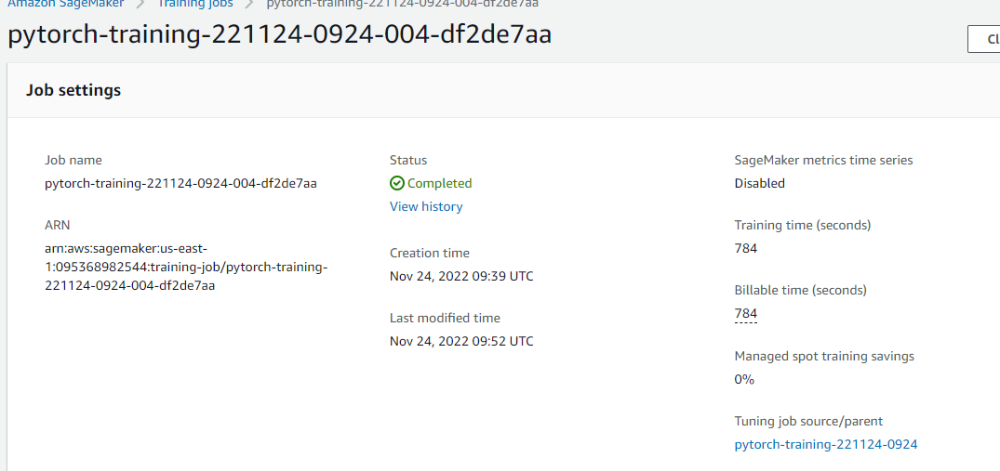
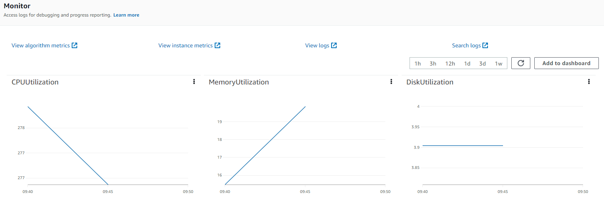
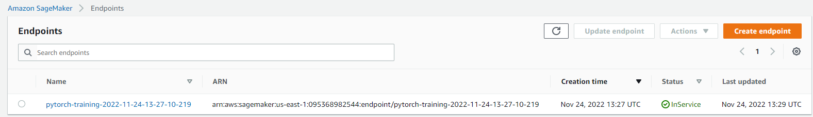

# Image Classification using AWS SageMaker

Use AWS Sagemaker to train a pretrained model that can perform image classification by using the Sagemaker profiling, debugger, hyperparameter tuning and other good ML engineering practices. This can be done on either the provided dog breed classication data set or one of your choice.

## Project Set Up and Installation
Enter AWS through the gateway in the course and open SageMaker Studio. 
Download the starter files.
Download/Make the dataset available. 

## Dataset
The provided dataset is the dogbreed classification dataset which can be found in the classroom.
The project is designed to be dataset independent so if there is a dataset that is more interesting or relevant to your work, you are welcome to use it to complete the project.

### Access
Upload the data to an S3 bucket through the AWS Gateway so that SageMaker has access to the data. 

## Hyperparameter Tuning
What kind of model did you choose for this experiment and why? Give an overview of the types of parameters and their ranges used for the hyperparameter search
For this project I chose the resnet50 pretrained model, because it was a pretrained model that has been used to predict images in kaggle competitions, based on that experience I utilized the model for dog image classification. I tuned three hyperparameters the learning rate, batch size and epochs.

Remember that your README should:

- Include a screenshot of completed training jobs

- Logs metrics during the training process

- Tune at least two hyperparameters - Tuned 3 hyperparameters
hyperparameter_ranges = {
    "lr": ContinuousParameter(0.001, 0.1),
    "batch_size": CategoricalParameter([16, 64, 256, 1024]),
    "epochs": IntegerParameter(2, 4)
}
- Retrieve the best best hyperparameters from all your training jobs
Best Hyperparameter values from my training jobs.

## Debugging and Profiling
**TODO**: Give an overview of how you performed model debugging and profiling in Sagemaker
Based on the concepts outlined in the SageMaker Debugger module (8. within Deep Learning Topics with computer vision and NLP) They detailed how to set hooks for debugging and profiling the python scripts within Sagemaker.

### Results
**TODO**: What are the results/insights did you get by profiling/debugging your model?
Some of the insights that I obtained from the profiling and debugging were the results of the rules that I setup.
    Rule.sagemaker(rule_configs.loss_not_decreasing()),
    ProfilerRule.sagemaker(rule_configs.LowGPUUtilization()),
    ProfilerRule.sagemaker(rule_configs.ProfilerReport()),
    Rule.sagemaker(rule_configs.vanishing_gradient()),
    Rule.sagemaker(rule_configs.overfit()),
    Rule.sagemaker(rule_configs.overtraining()),
    Rule.sagemaker(rule_configs.poor_weight_initialization())
    
allowing me to understand how these rules performed and if any failed or received an error. I did receive some errors which I can work to fix hopefully improve how the model preforms as accuracy was very bad.

**TODO** Remember to provide the profiler html/pdf file in your submission.

## Model Deployment
**TODO**: Give an overview of the deployed model and instructions on how to query the endpoint with a sample input.
import io
import torchvision.transforms

from PIL import Image

img = Image.open(data_dir)

    testing_transform = transforms.Compose([
        transforms.Resize((224, 224)),
        transforms.ToTensor(),
        transforms.Normalize([0.485, 0.456, 0.406], [0.229, 0.224, 0.225])
    ])

image = testing_transform(img)
image = image.unsqueeze(dim=0)
image.shape

Just like with the training and test loaders take the image and transform it and then send the image to the predictor.predict(image)

**TODO** Remember to provide a screenshot of the deployed active endpoint in Sagemaker.

## Standout Suggestions
**TODO (Optional):** This is where you can provide information about any standout suggestions that you have attempted.
